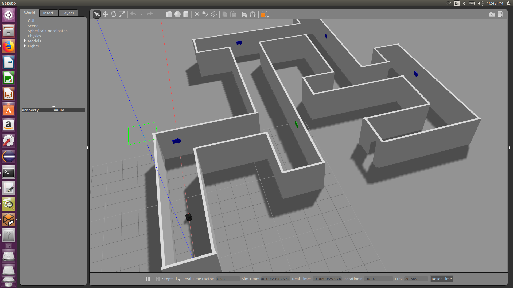
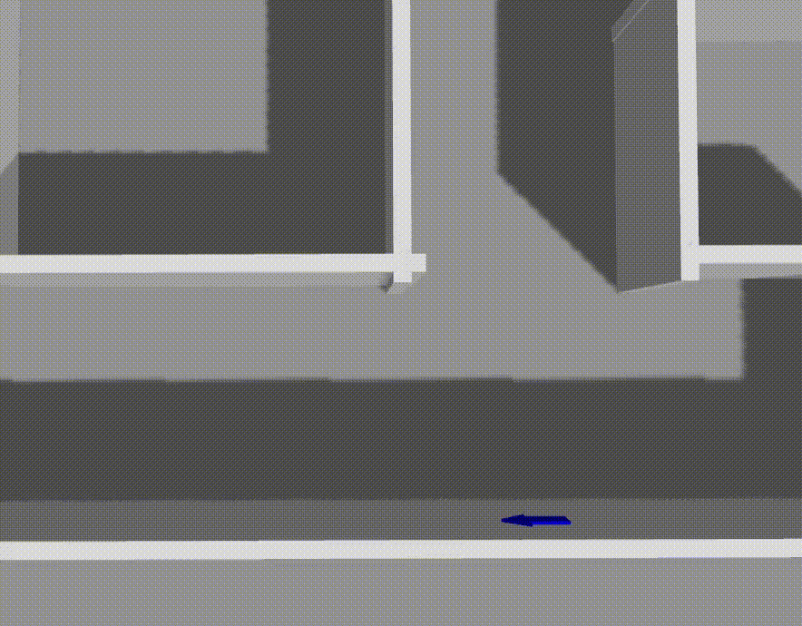
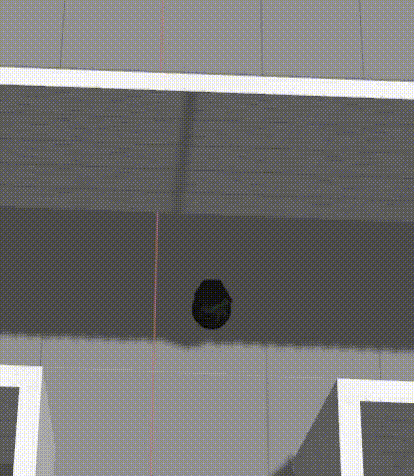
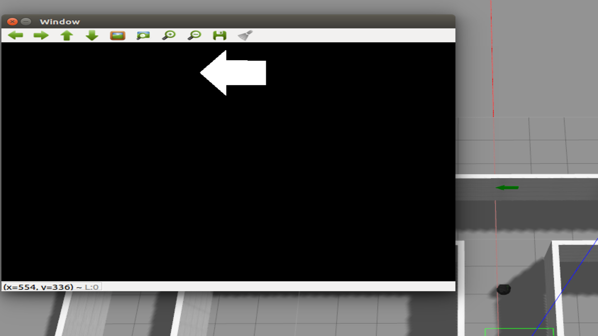
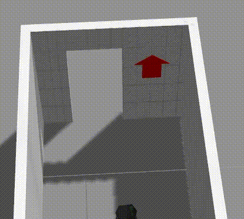
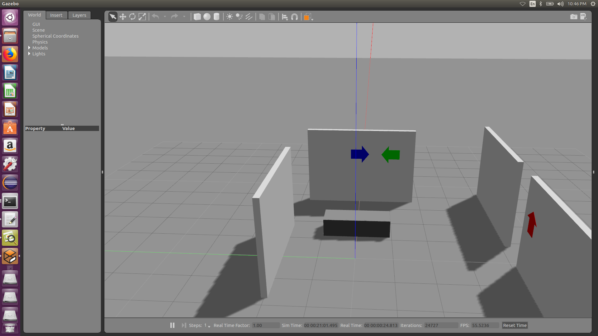

[](https://travis-ci.org/KrishnaBhatu/Emergency-Rescue-Robot)
[](https://coveralls.io/github/KrishnaBhatu/Emergency-Rescue-Robot?branch=master)
[](https://opensource.org/licenses/BSD-3-Clause)

<h1 align = "center">
  DAREDEVIL
</h1>
ENPM808X-Final Project (Frontier Exploration Robot: Explore an unknown space)

## Team Members

 - Krishna Bhatu [Github Link](https://github.com/KrishnaBhatu)
 - Siddhesh Rane [Github Link](https://github.com/srane96)
 
## Personnel

 - Krishna Bhatu (kbhatu@terpmail.umd.edu): A student of Masters in Robotics Engineering at the University of Maryland, College Park. My area of interest is computer vision, machine learning and aerial robotics.
  
 - Siddhesh Rane (srane96@terpmail.umd.edu): A student of Masters in Robotics Engineering at the University of Maryland, College Park. My area of interest is quadrotors, control systems, algorithms and data structures.
 
## Project Overview

This project implements the frontier exploration task where the robot has to react in an emergency situation and lead the person to the exit of the building. The project is just a simulation of the robot in Gazebo which will show the autonomous exploration of the unknown environment and finding the exit of the building by following the exit signs.

While traveling and exploring the unknown environment, the robot will face obstacles such as walls of the corridor, which it has to avoid and also it has to interpret the direction of the exit signs and turn accordingly. The robot moves in the direction of the exit sign until a turning point is detected by the laser sensor. The robot then takes the turn according to the turning direction interpreted from that sign. For the demonstration purpose, the direction of the exit signs are interpreted by different colors.

<p align="center">

</p>

## Application

Emergency situations are chaotic, and it is more difficult for the visually impaired people to face such situation which requires the evacuation of the building. So, the product could be installed in every building, which will be triggered into action as a reaction to an emergency situation to provide aid. This product will look for an emergency exit signs and guide the person to the exit as soon as possible.

## Project Output Flow

The project is basically the exploration of the building environment, from which the robot has to detect and follow the exit signs which will lead the robot to the exit. It is divided into 4 major tasks:

1) <b>Robot Positioning:</b>
  The idea behind this method is that the robot has to avoid any collision with the surrounding objects or walls and always travel in the center of the corridor of the building. This is important because it benefits the robot to determine the turning point and also to make the turn.
  For this method, we have used a basic <b>proportional gain</b> controller in which the difference in the right-most reading of distance(laser) sensor and the left-most reading of the distance(laser) sensor is used as an error. Now this error is multiplied by the gain and this value is given to the angular velocity. Thus robot tries to minimize this error to zero by turning with appropriate angles while moving forward. As a result, robot maintains an equal distance from the walls on the both sides.
<p align="center">
correcting factor = left distance - right distance;
</p>
<p align="center">
angular velocity = gain * correcting factor;
</p>
<p align="center">

</p>

2) <b>Wall Detection:</b>
  Since the robot is desined to work in a building, the major obstacle to the robot is the wall which has to be avoided and if the robot encounters a dead end then it has to find the path by itself to escape the building. Sometimes, unfortunately, if the exit sign is not detected by the robot due to many reasons like smoke present in the building due to fire or if the sign is broken; then the robot will not be able to make a decision to turn immediately after a turning point is reached. So the robot will keep moving until it reaches the dead end of the corridor and then check for the left and right path to select the longest path and then move in that direction. 
<p align="center">

</p>

3) <b>Image Processing:</b>
  The direction of the exit sign is determined by the color, so for the color detection, the image is first converted to the HSV format and then applied with the mask of the color that needs to be extracted from the image. Thus we were able to determine the color of the signs. According to which the direction of the sign was determined. 
  The turning point of the robot was determined when the exit sign approached close enough, that is, the exit sign was about to escape the camera frame, then the robot would know that the turning point has arrived and it has to make the turn according to the color of the sign. 
<p align="center">

</p>

4) <b>Door Detection:</b>
  The final task of this exploration is the door detection. In which robot has to go through the door without colliding with the edges of the door. Robot starts door detection and avoidance process as soon as it detects the red sign. The robot then reduces it's speed and uses proportional controller as explained in previous tasks, to go through the door without colliding.
<p align="center"> 

</p>

## Development using Solo Iterative Process (SIP) and Test-Driven Development (TDD)

In this project, a solo-iterative process is used where first the product backlog is created. Then the highest priority requirements are selected and assigned at the top of the TODO task. In the project backlog, estimated time of completion was allotted to every task. Actual time of completion was compared with the estimated time and based on that, the time allotement of the future tasks is modified.

After the planning is done, the UML flow diagram and the UML class diagram of the software are developed. Based on the UML diagrams the unit test classes are written. Then the stub classes are written with the functions matching the test cases. Thus the coverage of the software is maintained.

Following is the link to the spreadsheet that contains the detailed entries of the product backlog, time log, error log and release backlog - [link](https://docs.google.com/spreadsheets/d/1O63iHQKQJ4rw-KZTfBKcTz6vqTiGLA_Ci8IV8-E5Vwg/edit?ts=5bfdd247#gid=0)

## Sprint Planning and Review

Following is the link to the google doc with the sprint planning and review - [link](https://docs.google.com/document/d/1R3kuxY5z7W4jexqUmMMtAAA1UcctKT3b8epEXvo6OiU/edit?ts=5bfe07c4)

## Dependencies

 - Ubuntu 16.04
 - ROS Kinetic
 - Gazebo (if not already installed with ROS)
 - Turtlebot
 - python (if not already installed)
 - Googletest
 - OpenCV
 - rviz (optional)(if you want the visualization of the rostopics)
 - catkin_pkg (if not already installed while installing ROS)

For installing catkin_pkg and directly adding it to PYTHONPATH.
```
pip install catkin_pkg
```
Check if the catkin_pkg path is added to PYTHONPATH by using the following
command
```
echo $PYTHONPATH
```

## Installation

ROS Installation:
Install the ROS Kinetic for Ubuntu and it's dependencies using the [link](http://wiki.ros.org/kinetic/Installation/Ubuntu)

Gazebo Installation:
For the installation of Gazebo follow the [link](http://gazebosim.org/tutorials?tut=install_ubuntu)

To download the Turtlebot Simulink model use the following command;
```
sudo apt-get install ros-kinetic-turtlebot-gazebo ros-kinetic-turtlebot-apps ros-kinetic-turtlebot-rviz-launchers
```

To install Google Test follow the given [link](https://www.eriksmistad.no/getting-started-with-google-test-on-ubuntu/).

Install OpenCV on Linux by following the instructions on this [link](https://github.com/kyamagu/mexopencv/wiki/Installation-(Linux,-Octave,-OpenCV-3))

## Build Instructions

To make the catkin workspace:

--skip command 1 (sudo rm -R ~/catkin_ws) if no such folder is present in home directory

Open a terminal and type the following command:

```
sudo rm -R ~/catkin_ws
source /opt/ros/kinetic/setup.bash 
mkdir -p ~/catkin_ws/src
cd ~/catkin_ws/
cd src/
git clone https://github.com/KrishnaBhatu/Emergency-Rescue-Robot
cd ..
catkin_make
```
Now the package is ready to use

## Run Instructions

To run the demonstration of the project, run the following commands:

Commands to run the simulation in the smaller map (map1);
```
cd ~/catkin_ws/
source devel/setup.bash
roslaunch rescue_robot daredevil_map1.launch
```

Commands to run the simulation in the larger map (map2);
```
cd ~/catkin_ws/
source devel/setup.bash
roslaunch rescue_robot daredevil_map2.launch
```

Commands to run the simulation in the map without direction signs (map3);
```
cd ~/catkin_ws/
source devel/setup.bash
roslaunch rescue_robot daredevil_map2.launch
```

## Run Test Instructions
We have built the following world file for running the test so that robot will use most of it's
functions to reach the exit door.
<p align="center">

</p>  

To run the ros tests follow the commands:
```
cd ~/catkin_ws/
source devel/setup.bash
rostest rescue_robot test_rescue_bot
```
Or you can also run the test using following commands:
```
cd ~/catkin_ws/
source devel/setup.bash
catkin_make run_tests
```
<b>Note: It would take about 53 seconds to run all the tests.</b>
## Run Cpplint

In order to check if the Google style guide is followed, we run the cpplint check;
To install Cpplint follow the given command;
```
sudo apt-get install python-pip
sudo pip install cpplint
```

To run the cpplint, follow the given commands;
```
cd ~/catkin_ws/
cpplint $( find . -name \*.hpp -or -name \*.cpp | grep -vE -e "^./build/" -e "^./vendor/" -e "^./docs/" -e "^./results" )
```
## Run Cppcheck

To detect bugs and perform static code analysis, we use the Cppcheck tool.
To install Cppcheck follow the given commands;
```
sudo pip install cppcheck
```

To run the cppcheck, follow the given commands;
```
cd ~/catkin_ws/
cppcheck --enable=all --std=c++11 -I include/ --suppress=missingIncludeSystem $( find . -name *.cpp | grep -vE -e "^./build/" -e "^./vendor/" )
```

## LCOV
Local line and functional code coverage can be calculated using lcov. 
To use lcov use the following commands:
```
$ cd ~/catkin_ws/build
$ lcov --directory . --capture --output-file coverage.info
```
Now to output the coverage info of each file in the terminal use the command below
```
$ lcov --list coverage.info
```
To create an html file of the local coverage, run the below command.
```
$ genhtml coverage.info --output-directory covout
```
This will be stored in the index.html file in the folder covout.

## Documentation

If you want to generate the documentation of this project that includes templates and instructions of the classes used,then follow the instructions given below:
First install doxygen using following commands:
```
$ sudo apt-get install doxygen
$ sudo apt-get install doxygen-gui
```
Then run the following command to start the doxygen GUI.
```
$ doxywizard
```
Add the details of the project including title, description and version. Select your project directory as the source directory and create a new directory at the location of your choice and set it as the destination directory. 
Go to Expert > Input > INPUT and click on the file icon and select all the header files from 'include' directory of your project. Rest of the steps are easy to follow from instructions on the GUI. Finally click on 'run doxygen'. Your doxygen documentation will be generated in your destination folder.

## Record ROSBAG
Rostopics can be recorded for each map by providing an argument to each map using the following commands:
For map 1:
```
roslaunch rescue_robot daredevil_map1.launch run_rosbag:=true
```
For map 2:
```
roslaunch rescue_robot daredevil_map2.launch run_rosbag:=true
```
For map 3:
```
roslaunch rescue_robot daredevil_map3.launch run_rosbag:=true
```
Output will be stored in the results directory.

## Run ROSBAG
To play the bag files, go to the results directory and run the following command:
```
rosbag play {name_of_the_bag_file}.bag
```
Alternatively, you can use rqt_bag to view, inspect and publish the bag files. 
Navigate to the results folder and run the following command:
```
rqt_bag {name_of_the_bag_file}.bag
```
