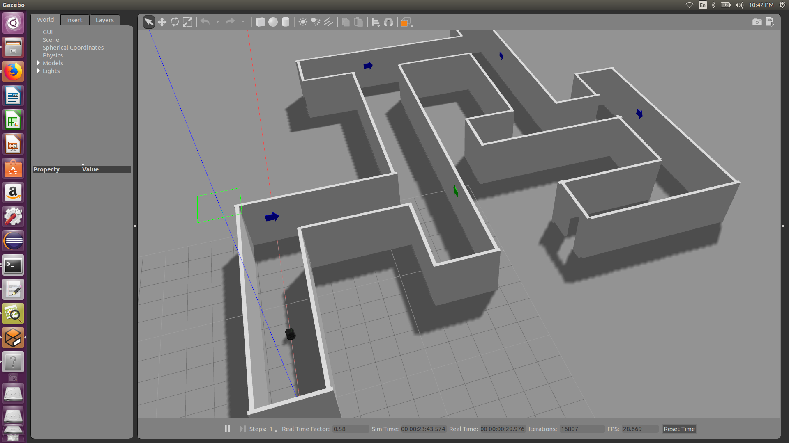
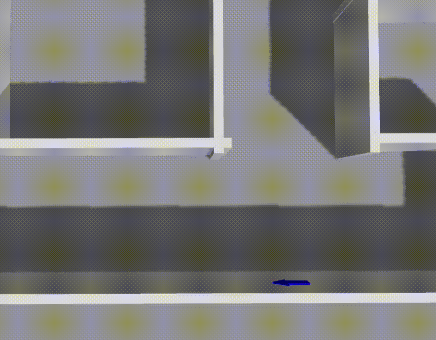
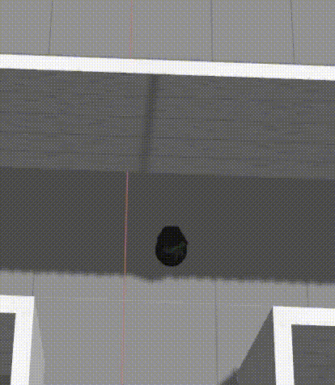
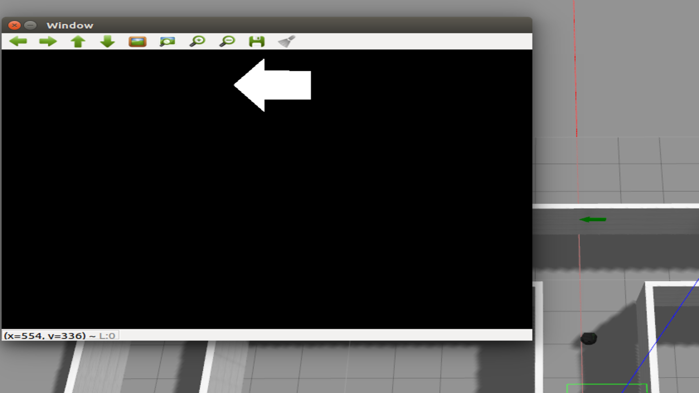
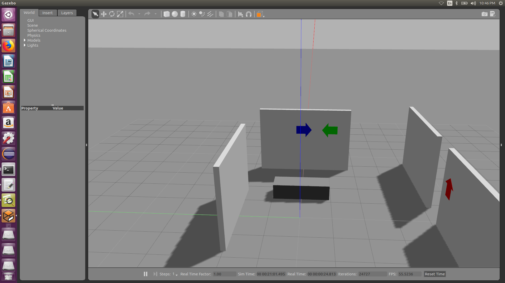

[](https://travis-ci.org/KrishnaBhatu/Emergency-Rescue-Robot)
[](https://coveralls.io/github/KrishnaBhatu/Emergency-Rescue-Robot?branch=master)
[](https://opensource.org/licenses/BSD-3-Clause)

<h1 align = "center">
  DAREDEVIL
</h1>
ENPM808X-Final Project (Frontier Exploration Robot: Explore an unknown space)

## Team Members

 - Krishna Bhatu [Github Link](https://github.com/KrishnaBhatu)
 - Siddhesh Rane [Github Link](https://github.com/srane96)
 
## Personnel

 - Krishna Bhatu (kbhatu@terpmail.umd.edu): A student of Masters in Robotics Engineering at the University of Maryland, College Park. My area of intrest is computer vision, machine learning and aerial robotics.
  
 - Siddhesh Rane (srane96@terpmail.umd.edu): A student of Masters in Robotics Engineering at the University of Maryland, College Park. My area of intrest is quadroters, control systems, algorithms and data structures.
 
## Project Overview

This project implements the frontier exploration task where the robot has to react in an emergency situation and lead the person to the exit of the building. The project is just a simulation of the robot in Gazrbo which will show the autonomous exploration of the unknown environment and finding the exit of the building by following the exit signs.

While travelling and exploring the unknown environment, the robot will face static obstacles which it has to avoid and also the robot has to interpret the direction of the exit signs and turn accordingly. Robot moves in the direction of the exit sign until an obstacle is detected by the laser sensor. Robot then follows the boundary of the obstacle until sign is visible again. Also, for the demonstration purpose, the direction of the exit signs are interpreted by different colors.

<p align="center">

</p>

## Application

Emergency situations are chaotic, and it is more difficult for the visually impaired people to face such situation which require the evacuation of the building. So, the product  could be installed in every building, which will be triggered into action as a reaction to emergency situation to provide aid. This product will look for emergency exit signs and guide the person to the exit as soon as possible.

## Project Output Flow

The project is basically the exploration of the building environment, from which the robot has to
detect and follow the exit signs which will lead the robot to the exit.
It is divided into 3 major tasks:

1) <b>Robot Positioning:</b>
  The idea behind this method is that the robot has to avoid any collision of the robot with the 
surrounding objects or walls and always maintain the center line in between the walls as the track of motion. This also benefits the robot while making a turn and determining the turning point.
  For this method we have used a basic <b>proportional gain</b> method where the difference in the distance from the right-most reading of distance(laser) sensor and the left-most reading of the distance(laser) sensor and feeding this correcting factor to move to the desired trajectory.
  Now this correcting factor is multiplied by the gain and this feedback value is given to the angular velocity.
<p align="center">
correcting factor = left distance - right distance;
</p>
<p align="center">
angular velocity = gain * correcting factor;
</p>
<p align="center">

</p>

2) <b>Wall Detection:</b>
  Now in our environment the major obstacle to the robot is the wall which has to be avoided and if we encounter a dead end then the robot has to find the path to escape the building. Sometimes, unfortunately if the exit sign is not detected by the robot due to many reasons like smoke present in the building due to fire or if the sign is broken.
  Then the robot will not be able to make a decision to turn, so the robot will reach the dead end facing the wall. Now the robot will check for left and right path and select the longest path and then look for exit signs in that direction. The same algorithm will be used to remove the robot from the dead ends, like when there is only one free path and walls on the other three sides.
<p align="center">

</p>

3) <b>Image Processing:</b>
  The direction of the exit sign are determined by the color, so for the color detection, the image is first converted to the HSV format and the applied with the mask of the color that needs to be extracted from the image. Thus we were able to determine the color of the signs. According to which the direction of the sign was determined. 
  The turning point of the robot was determined when the exit sign approched close enough , that is, the exit sign was about to escape the camera frame, then the robot would know that the turning point has arrived and it has to make the turn according to the color of the sign. 
<p align="center">

</p>  

## Development using Solo Iterative Process (SIP) and Test-Driven Development (TDD)

In this project, solo-iterative process is used where first the product backlog is created. Then the higest priority requirnments are selected and assigned at the top of the TODO task. In the project backlog, estimate time of completion was alloted to every task. Actual time of completion was compared with the estimated time and based on that, the time allotement of the future tasks is modified.

After the planning is done, the UML folw diagram and the UML class diagram of the software are developed. Based on the UML diagrams the unit test classes are written. Then the stub classes are written with the functions matching the test cases. Thus the coverage of the software is maintained.

Following is the link to the spreadsheet that contains the detailed entries of the product backlog, time log, error log and release backlog - [link](https://docs.google.com/spreadsheets/d/1O63iHQKQJ4rw-KZTfBKcTz6vqTiGLA_Ci8IV8-E5Vwg/edit?ts=5bfdd247#gid=0)

## Sprint Planning and Review

Following is the link to google doc with the sprint planning and review - [link](https://docs.google.com/document/d/1R3kuxY5z7W4jexqUmMMtAAA1UcctKT3b8epEXvo6OiU/edit?ts=5bfe07c4)

## Dependencies

 - Ubuntu 16.04
 - ROS Kinetic
 - Gazebo (if not already installed with ROS)
 - Turtlebot
 - python (if not already installed)
 - Googletest
 - OpenCV
 - rviz (optional)(if you want the visualization of the rostopics)
 - catkin_pkg (if not already installed while installing ROS)

For installing catkin_pkg and directly adding it to PYTHONPATH.
```
pip install catkin_pkg
```
Check if the catkin_pkg path is added to PYTHONPATH by using the following
command
```
echo $PYTHONPATH
```

## Installation

ROS Installation:
Install the ROS Kinetic for Ubuntu and it's dependencies using the [link](http://wiki.ros.org/kinetic/Installation/Ubuntu)

Gazebo Installation:
For the installation of Gazebo follow the [link](http://gazebosim.org/tutorials?tut=install_ubuntu)

To download the Turtlebot simulink model use the following command;
```
sudo apt-get install ros-kinetic-turtlebot-gazebo ros-kinetic-turtlebot-apps ros-kinetic-turtlebot-rviz-launchers
```

To install Google Test follow the given [link](https://www.eriksmistad.no/getting-started-with-google-test-on-ubuntu/).

Install OpenCV on Linux by following the instructions on this [link](https://github.com/kyamagu/mexopencv/wiki/Installation-(Linux,-Octave,-OpenCV-3))

## Build Instructions

To make the catkin workspace:

--skip command 1 (sudo rm -R ~/catkin_ws) if no such folder is present in home directory

Open a terminal and type the following command:

```
sudo rm -R ~/catkin_ws
source /opt/ros/kinetic/setup.bash 
mkdir -p ~/catkin_ws/src
cd ~/catkin_ws/
cd src/
git clone https://github.com/KrishnaBhatu/Emergency-Rescue-Robot
cd ..
catkin_make
```

Now the package is ready to use

## Run Instructions

To run the demonstration of the project, run the following commands:

Commands to run the simulation in map1;
```
cd ~/catkin_ws/
source devel/setup.bash
roslaunch rescue_robot daredevil_map1.launch
```

Commands to run the simulation in map2;
```
cd ~/catkin_ws/
source devel/setup.bash
roslaunch rescue_robot daredevil_map1.launch
```

## Run Test Instructions

We have built the following world file for running the test.
<p align="center">

</p>  

To run the ros tests follow the commands;
```
cd ~/catkin_ws/
source devel/setup.bash
roslaunch rescue_robot daredevi_test.launch
```
## Quality check

# Run Cpplint

In order to check if the google style guide is followed, we run the cpplint check;
To install Cpplint follow the given command;
```
sudo apt-get install python-pip
sudo pip install cpplint
```

To run the cpplint, follow the given commands;
```
cd ~/catkin_ws/
cpplint $( find . -name \*.hpp -or -name \*.cpp | grep -vE -e "^./build/" -e "^./vendor/" -e "^./docs/" -e "^./results" )
```
# Run Cpplint

To detect bugs and perform static code analysis, we use the Cppcheck tool.
To install Cppcheck follow the given commands;
```
sudo pip install cppcheck
```

To run the cppcheck, follow the given commands;
```
cd ~/catkin_ws/
cppcheck --enable=all --std=c++11 -I include/ --suppress=missingIncludeSystem $( find . -name *.cpp | grep -vE -e "^./build/" -e "^./vendor/" )
```

## Documentation

For the project we have used the doxygen style format to build the documentation.

## Video Presentation
TODO


 

